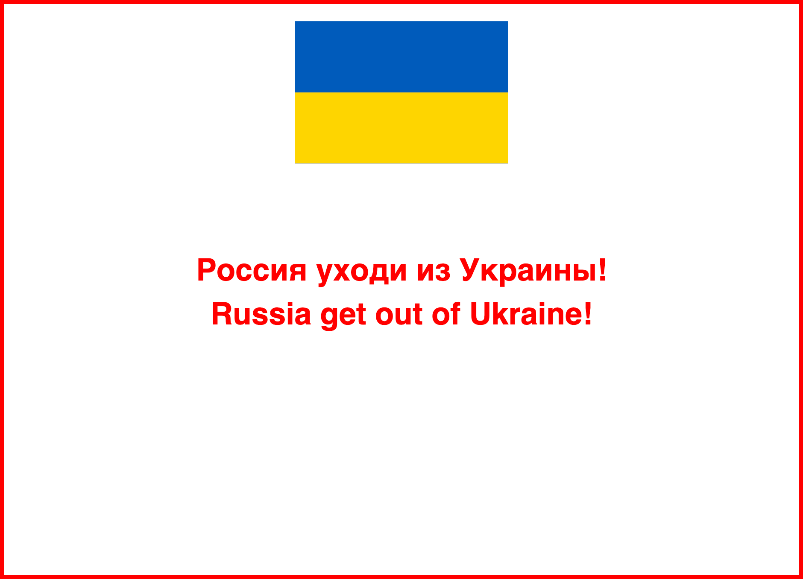

# Free Ukraine

Free Ukraine is a JavaScript web snippet that will block russian visitors on your website. It's designed to make blocking as simple as possible so that even non-technical users can join to push Russians to get out of Ukraine. Blocker can be used on all websites. Blocked visitors from Russia will see this:



## How to use

Put the following JavaScript on your website direcly or via Google Tag Manager, that's all you have to do:

```
<script src="https://freeukraine.vercel.app/js" async></script>
```

## Do you have more technical skills?

Feel free to deploy in your own [Vercel project](vercel) to make this project more scalable.

## License

Free. Free as Ukraine.
